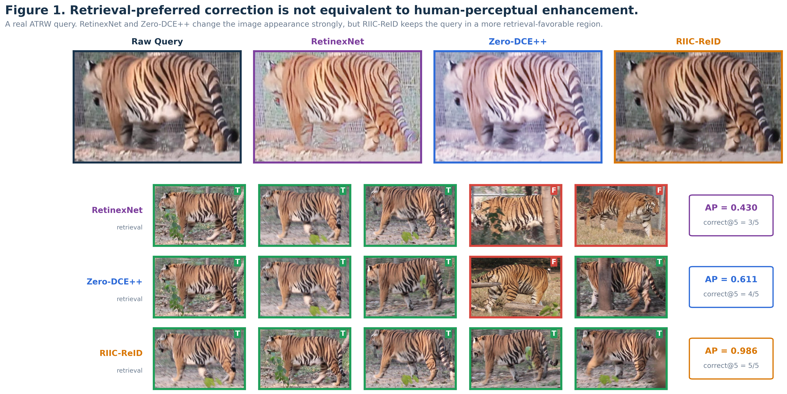
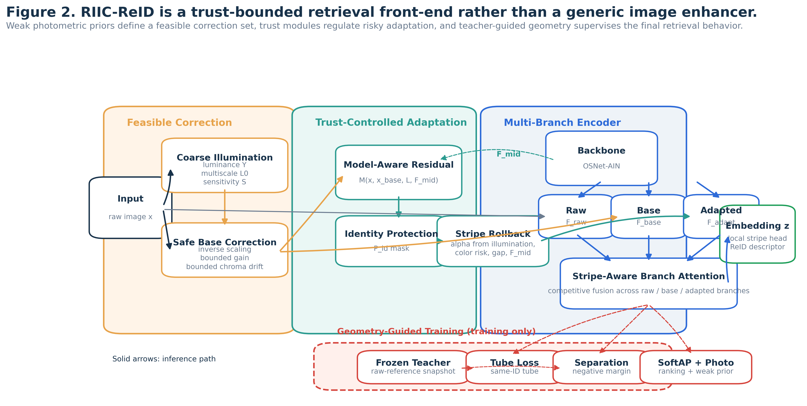
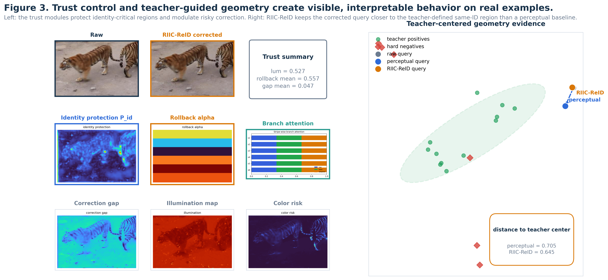

# RIIC-ReID

This repository updates the earlier `IICL-WildlifeReID` release and now centers on **RIIC-ReID: Retrieval-Informed Illumination Correction for Cross-Light Re-Identification**. The repository name is kept for continuity, but the current release is aligned with the newer paper, figures, configs, tests, and experiment runners.

<p align="center">
  
</p>

## Overview

RIIC-ReID studies a simple but important mismatch: illumination correction methods are usually optimized for human perception, while re-identification systems are judged by downstream retrieval geometry. This release packages the current research code, curated paper assets, and reproducible experiment entry points for the RIIC-ReID line.

- **Feasible correction** keeps illumination adaptation inside a bounded, photometrically safe region.
- **Trust-controlled adaptation** blends raw, base-corrected, and refined branches instead of always trusting stronger enhancement.
- **Geometry-guided supervision** aligns corrected descriptors with retrieval-friendly teacher structure rather than perceptual appearance alone.

## Main Results

The anonymized ACM MM paper included in this repository reports:

| Setting | Baseline | RIIC-ReID | Takeaway |
| --- | --- | --- | --- |
| ATRW matched protocol | mmAP 56.69 | **58.11** | Retrieval-informed correction improves over the plain baseline. |
| ATRW vs illumination-only front-end | weaker | **stronger** | Correction alone is not enough without retrieval coupling. |
| GZGC Zebra and StripeSpotter fixed query/gallery | perceptual baselines less consistent | **RIIC-ReID preferred** | The same trend transfers beyond ATRW. |

The headline claim and method evidence are visualized below.

<p align="center">
  
  
</p>

## Repository Layout

| Path | Purpose |
| --- | --- |
| `app/core/` | Core model, losses, config loading, evaluation, and open-set logic. |
| `config/` | Main RIIC-ReID configs, ablations, cross-species settings, and TMM extensions. |
| `tools/` | Training, evaluation, ablation, figure generation, and analysis entry points. |
| `tests/` | Regression tests for route-B upgrades, alignment losses, ablation derivation, and evaluation logic. |
| `paper/` | Anonymized paper PDF/TeX/BibTeX, generated figures, and supplementary package. |
| `scripts/` | Lightweight helper shell scripts used in the research workflow. |

## Paper Assets

- Main PDF: [`paper/acmmm_mm2026_anonymous.pdf`](paper/acmmm_mm2026_anonymous.pdf)
- Main TeX source: [`paper/acmmm_mm2026_anonymous.tex`](paper/acmmm_mm2026_anonymous.tex)
- BibTeX database: [`paper/acmmm_mm2026_refs.bib`](paper/acmmm_mm2026_refs.bib)
- Figure captions: [`paper/figures/captions.md`](paper/figures/captions.md)
- Supplementary package: [`paper/supplementary/supplementary_package_20260402.zip`](paper/supplementary/supplementary_package_20260402.zip)

Additional asset notes live in [`paper/README.md`](paper/README.md).

## Environment

This release is organized for **Ubuntu/Linux-first research use**, not a Windows runtime bundle.

- Ubuntu 22.04 or a comparable Linux environment is recommended.
- Python 3.10+ is the main target.
- CUDA is recommended for training and most figure-generation workflows.

Example setup:

```bash
git clone git@github.com:ddyy-hash/IICL-WildlifeReID.git
cd IICL-WildlifeReID

python -m venv .venv
source .venv/bin/activate

# Install the matching PyTorch build for your CUDA version first.
pip install torch torchvision --index-url https://download.pytorch.org/whl/cu118
pip install -r requirements.txt
```

Some optional utilities in `tools/` also rely on packages such as `pandas`, `scipy`, `scikit-learn`, `optuna`, `paramiko`, `timm`, `transformers`, or `faiss`. Those are not required for the base train/eval path, but they are useful for extended analysis, hyperparameter search, or remote-sync tooling.

## Reproducibility Entry Points

Representative commands:

```bash
# Main joint training
python tools/train_joint.py \
  --config config/illumination_config_atrw.yaml \
  --data_dir data/processed/atrw/train \
  --query_dir data/processed/atrw/query \
  --gallery_dir data/processed/atrw/gallery \
  --output_dir checkpoints/atrw_main

# Standard retrieval evaluation
python tools/evaluate_reid.py \
  --checkpoint checkpoints/atrw_main/joint_best_reid_best.pth \
  --query_dir data/processed/atrw/query \
  --gallery_dir data/processed/atrw/gallery

# ATRW open-set evaluation
python tools/eval_atrw_openset.py \
  --checkpoint checkpoints/atrw_main/joint_best_reid_best.pth \
  --test_dir data/processed/atrw/test
```

Useful experiment runners:

- `tools/run_atrw_main_ablation.py`
- `tools/run_cross_species_paper_ablation.py`
- `tools/run_perceptual_baseline_ablation.py`
- `tools/run_tmm_component_ablation.py`
- `tools/run_selection_locked_rerank.py`

Useful figure and evidence tools:

- `tools/draw_riic_main_paper_figures.py`
- `tools/prepare_rift_paper_figure_assets.py`
- `tools/visualize_joint_analysis.py`
- `tools/analyze_light_bins.py`

## Tests

The repository includes targeted regression tests for the retrieval-guided route-B upgrades and ablation tooling. A good quick verification set is:

```bash
pytest \
  tests/test_route_b_upgrade.py \
  tests/test_route_b_alignment_runtime.py \
  tests/test_atrw_main_ablation.py \
  tests/test_tmm_component_ablation.py -q
```

## Notes

- Raw datasets, cached checkpoints, runtime logs, and temporary outputs are intentionally excluded from this publish branch.
- The codebase still contains earlier IICL/IPAID-era utilities where they remain useful for historical comparison or migration, but the repository-level story and paper assets now follow the RIIC-ReID line.

## Citation

If this repository helps your work, please cite the RIIC-ReID paper version packaged here.

```bibtex
@misc{ding2026riicreid,
  title        = {RIIC-ReID: Retrieval-Informed Illumination Correction for Cross-Light Re-Identification},
  author       = {Anonymous Author(s)},
  year         = {2026},
  howpublished = {\url{https://github.com/ddyy-hash/IICL-WildlifeReID}}
}
```

## License

This project is released under the [MIT License](LICENSE).
