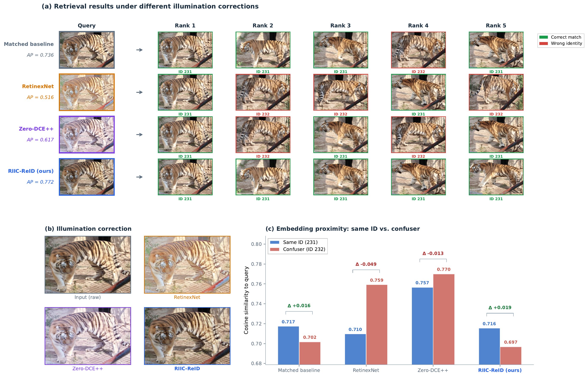
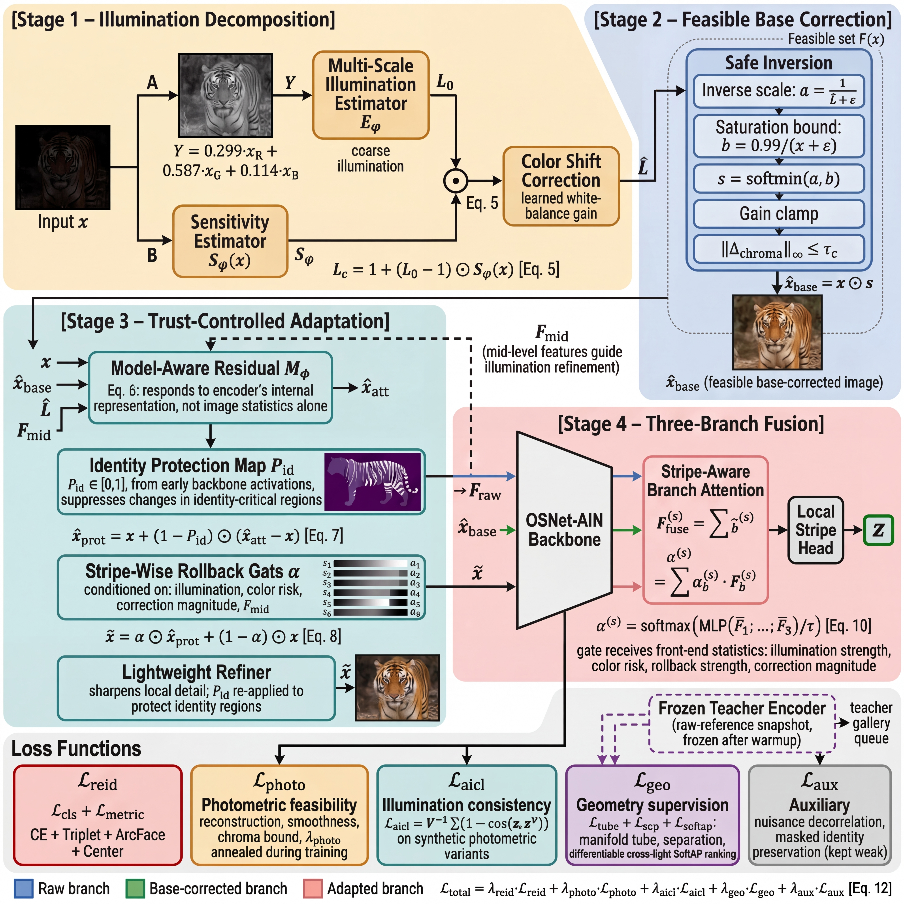

# IICL-WildlifeReID / RIIC-ReID

Research code for **RIIC-ReID: Retrieval-Informed Illumination Correction for Cross-Light Wildlife Re-Identification**.

This repository is kept under the original `IICL-WildlifeReID` name for continuity, but the current public release focuses on a newer RIIC-ReID research prototype: a task-aligned illumination front-end that is optimized for retrieval geometry instead of human-perceptual image enhancement alone.

<p align="center">
  
</p>

## What This Project Demonstrates

- **Retrieval-first illumination correction.** Illumination handling is trained as part of the ReID system, not as a generic image preprocessing step.
- **Trust-bounded adaptation.** Raw, base-corrected, and adapted branches are fused with stripe-aware trust gates to avoid over-correcting identity-critical regions.
- **Geometry-guided supervision.** A frozen teacher encoder constrains corrected features to stay near same-identity retrieval neighborhoods while preserving separation from hard negatives.
- **Wildlife ReID evaluation.** The code targets ATRW, GZGC Zebra, StripeSpotter, and related cross-species ReID settings where lighting, viewpoint, and local texture are tightly coupled.
- **Reproducible research workflow.** The release includes configs, ablation runners, analysis scripts, and regression tests, while excluding raw datasets, checkpoints, logs, and private writing artifacts.

## Method Overview

RIIC-ReID starts from a bounded feasible correction stage, then lets model-aware trust modules decide where correction should be applied. The retrieval encoder keeps multiple evidence streams and learns how much to trust each branch per body stripe.

<p align="center">
  
</p>

The key idea is simple: an image that looks better to a person can still be worse for nearest-neighbor retrieval. RIIC-ReID therefore treats photometric priors as safety constraints and lets downstream retrieval geometry choose the useful correction direction.

## Main Results

### ATRW Main Ablation

| Variant | Single-camera mAP | Cross-camera mAP | mmAP | Relative to baseline |
| --- | ---: | ---: | ---: | ---: |
| Baseline | 72.52 | 40.87 | 56.69 | 0.00 |
| Naive illumination | 71.65 | 39.60 | 55.62 | -1.07 |
| Illumination only | 74.30 | 41.43 | 57.86 | +1.17 |
| Full RIIC-ReID | **74.43** | **41.80** | **58.11** | **+1.42** |

### Cross-Backbone Robustness

| Backbone | Baseline mmAP | Full RIIC-ReID mmAP | Gain |
| --- | ---: | ---: | ---: |
| OSNet-AIN X1.0 | 56.69 | **58.11** | **+1.42** |
| OSNet X1.0 | 59.06 | **60.50** | **+1.44** |
| ResNet-50 | 56.61 | **57.62** | **+1.01** |

### Cross-Species Fixed Query/Gallery Evaluation

| Dataset | Variant | Rank-1 | mAP | Relative to baseline |
| --- | --- | ---: | ---: | ---: |
| GZGC Zebra | Baseline | 71.70 | 70.32 | 0.00 |
| GZGC Zebra | Generic illumination | 74.48 | 72.71 | +2.39 |
| GZGC Zebra | Full RIIC-ReID | **75.92** | **74.22** | **+3.90** |
| StripeSpotter | Baseline | 93.00 | 91.55 | 0.00 |
| StripeSpotter | Generic illumination | 92.00 | 91.29 | -0.26 |
| StripeSpotter | Full RIIC-ReID | **94.00** | **93.89** | **+2.34** |

### Perceptual Enhancement Baselines

| Dataset | Method | Single-camera mAP | Cross-camera mAP | mmAP / mAP |
| --- | --- | ---: | ---: | ---: |
| ATRW | Zero-DCE++ | 73.14 | 42.36 | 57.75 mmAP |
| ATRW | RetinexNet | 71.70 | 41.64 | 56.67 mmAP |
| ATRW | Full RIIC-ReID | **74.43** | **41.80** | **58.11 mmAP** |
| GZGC Zebra | Zero-DCE++ | - | - | 67.31 mAP |
| GZGC Zebra | RetinexNet | - | - | 68.51 mAP |
| GZGC Zebra | Full RIIC-ReID | - | - | **74.22 mAP** |

## Repository Layout

| Path | Purpose |
| --- | --- |
| `app/core/` | Model components, losses, data loading, evaluation, and open-set recognition utilities. |
| `config/` | Main RIIC-ReID configs, ablation configs, cross-species settings, and TMM experiment variants. |
| `tools/` | Training, evaluation, preprocessing, ablation, plotting, and analysis entry points. |
| `tests/` | Regression tests for model upgrades, ablation derivation, protocol handling, and evaluation edge cases. |
| `docs/figures/` | Two public README figures selected from the research artifacts. |
| `scripts/` | Small shell helpers for repeatable experiment runs. |

The public repository intentionally does **not** include manuscript sources, raw datasets, trained checkpoints, runtime caches, or temporary experiment outputs.

## Environment

The code is organized for Linux-first research use.

- Ubuntu 22.04 or a comparable Linux environment is recommended.
- Python 3.10+ is the main target.
- CUDA is recommended for training and full-scale evaluation.

```bash
git clone git@github.com:ddyy-hash/IICL-WildlifeReID.git
cd IICL-WildlifeReID

python -m venv .venv
source .venv/bin/activate

# Install the PyTorch build that matches your CUDA version first.
pip install torch torchvision --index-url https://download.pytorch.org/whl/cu118
pip install -r requirements.txt
```

Some optional tools require additional packages such as `pandas`, `scipy`, `scikit-learn`, `optuna`, `timm`, `transformers`, or `faiss`. They are useful for extended analysis, hyperparameter search, and figure generation, but are not required for the base train/eval entry points.

## Data Layout

Raw datasets are not redistributed in this repository. A typical processed layout is:

```text
data/
  processed/
    atrw/
      train/
      query/
      gallery/
      test/
    gzgc_zebra/
      train/
      query/
      gallery/
    stripespotter/
      train/
      query/
      gallery/
```

Dataset preprocessing helpers live under `tools/`, including:

- `tools/prepare_atrw_official.py`
- `tools/prepare_reid_datasets.py`
- `tools/preprocess_gzgc.py`
- `tools/preprocess_stripespotter.py`

## Train And Evaluate

Representative commands:

```bash
# Main joint training
python tools/train_joint.py \
  --config config/illumination_config_atrw.yaml \
  --data_dir data/processed/atrw/train \
  --query_dir data/processed/atrw/query \
  --gallery_dir data/processed/atrw/gallery \
  --output_dir checkpoints/atrw_riic

# Standard retrieval evaluation
python tools/evaluate_reid.py \
  --checkpoint checkpoints/atrw_riic/joint_best_reid_best.pth \
  --query_dir data/processed/atrw/query \
  --gallery_dir data/processed/atrw/gallery

# ATRW open-set evaluation
python tools/eval_atrw_openset.py \
  --checkpoint checkpoints/atrw_riic/joint_best_reid_best.pth \
  --test_dir data/processed/atrw/test
```

Useful experiment runners:

- `tools/run_atrw_main_ablation.py`
- `tools/run_perceptual_baseline_ablation.py`
- `tools/run_tmm_component_ablation.py`
- `tools/run_selection_locked_rerank.py`
- `tools/run_ablation.py`

Useful analysis tools:

- `tools/visualize_joint_analysis.py`
- `tools/analyze_light_bins.py`
- `tools/plot_ablation_study.py`
- `tools/plot_all_tables.py`

## Tests

Run the lightweight regression set:

```bash
pytest \
  tests/test_route_b_upgrade.py \
  tests/test_route_b_alignment_runtime.py \
  tests/test_atrw_main_ablation.py \
  tests/test_tmm_component_ablation.py -q
```

## Public Release Notes

- Manuscript source files, conference templates, BibTeX databases, supplementary packages, and build artifacts are kept outside this repository.
- Raw datasets, model weights, feature arrays, logs, and runtime outputs are excluded by `.gitignore`.
- The code still contains a few earlier IICL/IPAID-era utilities where they remain useful for comparison or migration, but the README and public presentation now center on RIIC-ReID.

## License

This project is released under the [MIT License](LICENSE).
